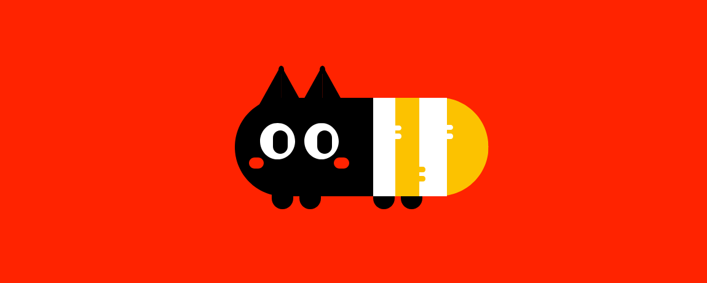
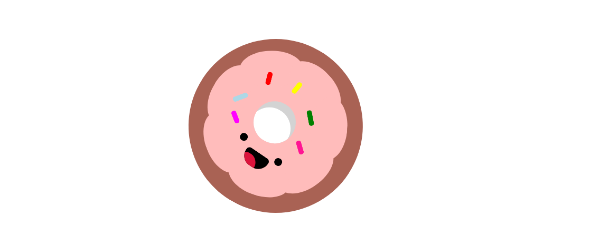
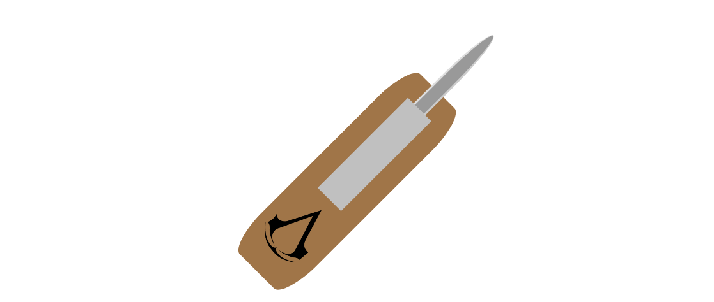

# CSS::anything

CSS::anything is an imersive and reactive CSS training which aims to deepen and uncover CSS concepts through the cration of pens at CodePen.
In this training we show to students that CSS concepts can be learned in a different and creative way, in addition we working on the  abstraction from layout for the code.

Here are some of the contents covered:

- How to get inspired at Dribbble;
- How to implement Dribbble shots;
- Positioning elements with CSS;
- Drawing with CSS;
- CSS transitions and efects;
- CSS animations;

You can read about the first CSS::anything training session [here](https://medium.com/sorocabacss/css-anything-an-imersive-and-reactive-css-training-391ebf30c9f7)

## Featured Pens by Students

### Cat in a sweater by [Vinícius Puente](https://codepen.io/PuenteVinicius/pen/zzjPyN)

### Cute donnt by [Gisele Atadaime](https://codepen.io/Gitamie/pen/KqRyEw)

### Hidden blade by [Lucas Flaquer](https://codepen.io/LucasFlaquer/pen/awKLLX)

### Geometric Cat by [Ricardo Hiroyuki](https://codepen.io/rhiroyuki/pen/dReZBm)

### BB8 by [Vitor Manfré](https://codepen.io/vitormdias/pen/pwKBmR)

